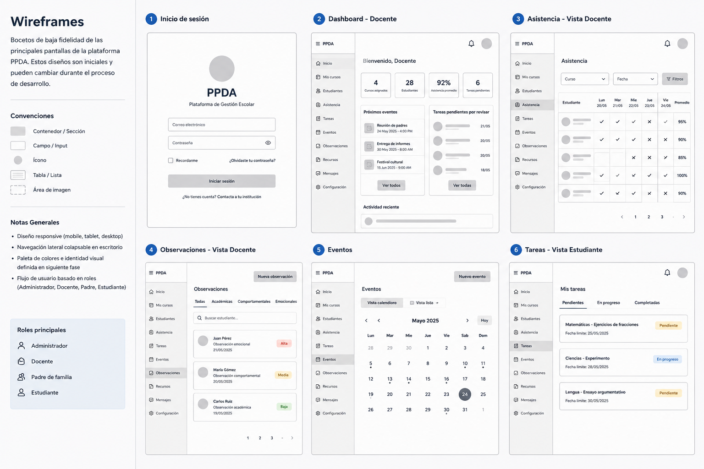

# Wireframes Iniciales

Estos wireframes representan una propuesta inicial de estructura visual y organización funcional de la plataforma PPDA.

## Objetivo
Definir de manera temprana:
- distribución general de módulos,
- experiencia de usuario,
- navegación,
- dashboards por rol,
- y flujo inicial de interacción.

## Pantallas consideradas inicialmente
- Inicio de sesión
- Dashboard docente
- Asistencia emocional
- Observaciones
- Eventos
- Tareas del estudiante

## Nota
Estos wireframes son únicamente una referencia inicial de baja fidelidad.

Posteriormente:
- se desarrollará el diseño UI/UX completo en Figma,
- se definirá sistema de diseño,
- componentes reutilizables,
- paleta de colores,
- tipografía,
- y responsive design.

